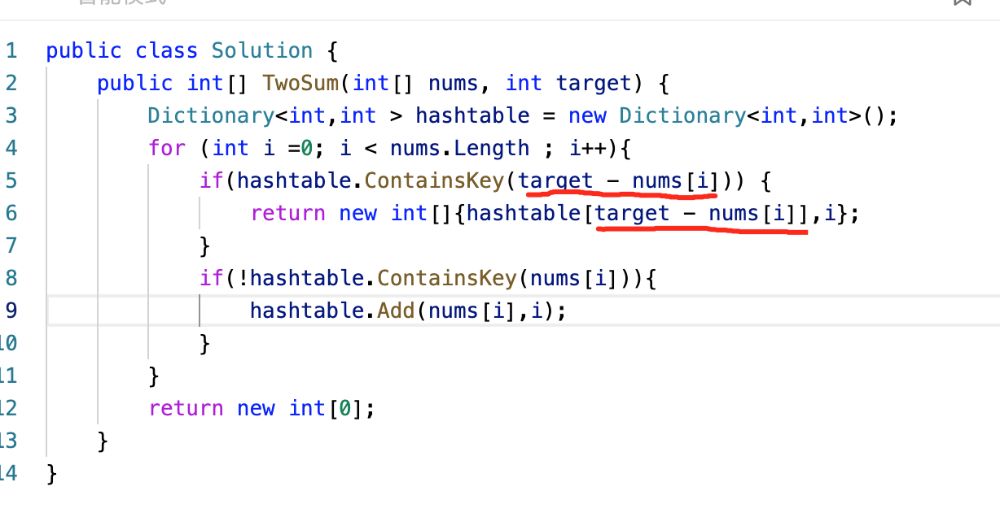
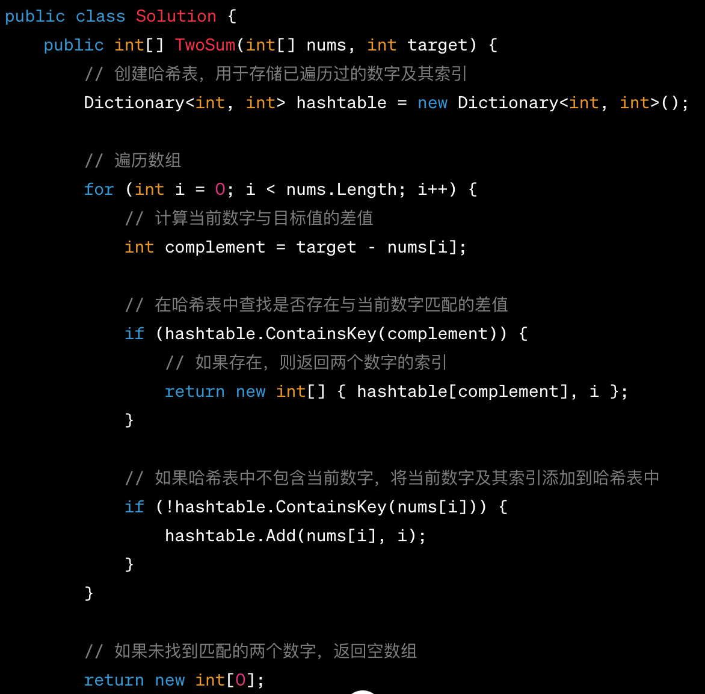

# LeetCode 第 1 号问题：两数之和

> 本文首发于公众号「图解面试算法」，是 [图解 LeetCode ](<https://github.com/MisterBooo/LeetCodeAnimation>) 系列文章之一。
>
> 同步博客：https://www.algomooc.com
>

题目来源于 LeetCode 上第 1 号问题：两数之和。题目难度为 Easy，目前通过率为 45.8% 。

### 题目描述

给定一个整数数组 `nums` 和一个目标值 `target`，请你在该数组中找出和为目标值的那 **两个** 整数，并返回他们的数组下标。

你可以假设每种输入只会对应一个答案。但是，你不能重复利用这个数组中同样的元素。

**示例:**

```
给定 nums = [2, 7, 11, 15], target = 9

因为 nums[0] + nums[1] = 2 + 7 = 9
所以返回 [0, 1]
```

### 题目解析

使用查找表来解决该问题。

设置一个 map 容器 record 用来记录元素的值与索引，然后遍历数组 nums。

* 每次遍历时使用临时变量 complement 用来保存目标值与当前值的差值
* 在此次遍历中查找 record ，查看是否有与 complement 一致的值，如果查找成功则返回查找值的索引值与当前变量的值 i
* 如果未找到，则在 record 保存该元素与索引值 i

### 动画描述


### 代码实现
#### C++
```
// 1. Two Sum
// https://leetcode.com/problems/two-sum/description/
// 时间复杂度：O(n)
// 空间复杂度：O(n)
class Solution {
public:
    vector<int> twoSum(vector<int>& nums, int target) {
        unordered_map<int,int> record;
        for(int i = 0 ; i < nums.size() ; i ++){
       
            int complement = target - nums[i];
            if(record.find(complement) != record.end()){
                int res[] = {i, record[complement]};
                return vector<int>(res, res + 2);
            }

            record[nums[i]] = i;
        }
        return {};
    }
};

```
#### C
```c
// 1. Two Sum
// https://leetcode.com/problems/two-sum/description/
// 时间复杂度：O(n)
// 空间复杂度：O(n)
/**
 * Note: The returned array must be malloced, assume caller calls free().
 */
int* twoSum(int* nums, int numsSize, int target, int* returnSize){
    int *ans=(int *)malloc(2 * sizeof(int));
    int i,j;
    bool flag=false; 
    for(i=0;i<numsSize-1;i++)
    {
        for(j=i+1;j<numsSize;j++)
        {
            if(nums[i]+nums[j] == target)
            {
                ans[0]=i;
                ans[1]=j;
                flag=true;
            }
        }
    }
    if(flag){
        *returnSize = 2;
    }
    else{
        *returnSize = 0;
    }
    return ans;
}
```
#### Java
```
// 1. Two Sum
// https://leetcode.com/problems/two-sum/description/
// 时间复杂度：O(n)
// 空间复杂度：O(n)
class Solution {
    public int[] twoSum(int[] nums, int target) {
        int l = nums.length;
        int[] ans=new int[2];
        int i,j;
        for(i=0;i<l-1;i++)
        {
            for(j=i+1;j<l;j++)
            {
                if(nums[i]+nums[j] == target)
                {
                    ans[0]=i;
                    ans[1]=j;
                }
            }
        }
        
        return ans;
        
    }
}
```
#### Python
```
# 1. Two Sum
# https://leetcode.com/problems/two-sum/description/
# 时间复杂度：O(n)
# 空间复杂度：O(n)
class Solution(object):
    def twoSum(self, nums, target):
        l = len(nums)
        print(nums)
        ans=[]
        for i in range(l-1):
            for j in range(i+1,l):
                if nums[i]+nums[j] == target:
                    ans.append(i)
                    ans.append(j)
                    print([i,j])
                    break
        return ans
```


#### C#

```c#
public class Solution {
    public int[] TwoSum(int[] nums, int target) {
        // 创建哈希表，用于存储已遍历过的数字及其索引
        Dictionary<int, int> hashtable = new Dictionary<int, int>();

        // 遍历数组
        for (int i = 0; i < nums.Length; i++) {
            // 计算当前数字与目标值的差值
            int complement = target - nums[i];

            // 在哈希表中查找是否存在与当前数字匹配的差值
            if (hashtable.ContainsKey(complement)) {
                // 如果存在，则返回两个数字的索引
                return new int[] { hashtable[complement], i };
            }

            // 如果哈希表中不包含当前数字，将当前数字及其索引添加到哈希表中
            if (!hashtable.ContainsKey(nums[i])) {
                hashtable.Add(nums[i], i);
            }
        }

        // 如果未找到匹配的两个数字，返回空数组
        return new int[0];
    }
}
```


1. **第一次迭代（i=0）：**

   - 当前数字：3
   - 计算 `complement`（目标值与当前数字的差值）：`complement = 6 - 3 = 3`
   - 在哈希表中查找是否存在 `complement`（3），但哈希表为空，因此不执行此条件。
   - 将当前数字 `3` 及其索引 `0` 添加到哈希表中。

   此时哈希表内容：`{ 3: 0 }`

2. **第二次迭代（i=1）：**

   - 当前数字：2
   - 计算 `complement`：`complement = 6 - 2 = 4`
   - 在哈希表中查找是否存在 `complement`（4），但哈希表为空，因此不执行此条件。
   - 将当前数字 `2` 及其索引 `1` 添加到哈希表中。

   此时哈希表内容：`{ 3: 0, 2: 1 }`

3. **第三次迭代（i=2）：**

   - 当前数字：4
   - 计算 `complement`：`complement = 6 - 4 = 2`
   - 在哈希表中查找是否存在 `complement`（2），发现存在，返回匹配的两个数字的索引：`[1, 2]`

   由于找到了答案，循环结束，返回结果 `[1, 2]`。


| 改动前                                                       | 改动后                                                       |
| ------------------------------------------------------------ | ------------------------------------------------------------ |
|  |  |


